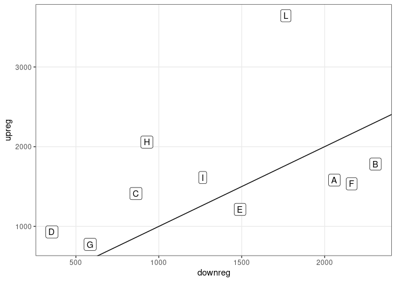

Differential gene expression across the *Schistocephalus* life cycle
================

-   [Filtering genes with low
    expression](#filtering-genes-with-low-expression)
-   [Models for differential gene
    expression](#models-for-differential-gene-expression)
-   [Extracting differentially expressed genes at each life
    stage](#extracting-differentially-expressed-genes-at-each-life-stage)
-   [Unadjusted and adjusted
    contrasts](#unadjusted-and-adjusted-contrasts)
-   [Shared expression among stages](#shared-expression-among-stages)
-   [DESeq2 vs Wilcoxon tests](#deseq2-vs-wilcoxon-tests)

The goal of this script is to test the different models to understand
the pattern of gene expression across the Schistocephalus life cycle.

There are \~20,000 genes from 72 samples.

    ## [1] 20228    72

# Filtering genes with low expression

The data are in wide format with each column representing a sample and
each row a gene. We will make the data long, so that each combination of
gene and sample has its own row (i.e. all expression counts are in a
single column).

Here is the distribution of counts for every gene in every sample. In
most samples in most genes, no expression is detectable.

<!-- -->

When we exclude the zeros (no expression), we see a bimodal
distribution. In many genes in many samples, counts are low (peak at
one) and probably just represent noise. The peak at higher values
probably represents “real” expression, say greater than 10 counts per
gene.

<!-- --> The
pattern is similar within each of our treatment groups. There is a fair
amount of low-level expression that is probably just noise, and then
from 10 counts or so there seems to be genuine expression. The separate
lines are for the different samples. They show that the distribution of
expression counts is similar across replicates.

<!-- -->

We can take the median expression level for each gene in each condition
and make the same plot. Clearly some of the low-level expression can be
removed.

<!-- -->

As an arbitrary threshold, we will remove genes that do not have a
median expression level of at least 10 counts in at least one condition.

Here is the percent of genes removed.

    ## [1] 0.397

Doubling the threshold for expression counts (20) only removes a few
percent more.

    ## [1] 0.425

Similarly halving the threshold (5) would only add a few percent of the
genes back into the analysis.

    ## [1] 0.372

Specifically, it would add this many genes back into the analysis:

    ## [1] 506

# Models for differential gene expression

Now, we fit models with `DESeq2`. A glm is fitted for each gene, and we
fit models with different predictors. First, we fit a model with just
the *host* (i.e. free vs copepod vs fish vs bird). Second, we fit a
model with just the *functional stage* (i.e. infecting vs growing vs
transmission). Finally, we fit a model that combines host and function,
in which a separate mean was estimated for each *developmental stage*
sampled.

M1 would be the dataset loaded in DEseq with the Host as design

The we use DEseq with the likelihood ratio test to compare the Host
model with the intercept

Calculate the results

Load the data with Stage as design: M2

Test Stage against intercept

Calculate the results

Load the data with Host and Stage interaction (Condition) against the
intercept: M3

Now Test the M3 model (Host \* Stage) against the intercept

Load the data with Design condition usign a matrix to then test against
the Host and Stage

Since we used a matrix for full model we have to use the matrix for Host

Now we test the the condition and the Host

Now with the same data loaded in M4 (condmatrix) we test against the
stage, so we need a stage matrix

And then we test

Now I have to create a data frame to plot and compare the models. So I
have to take the adjpvalues. I’ll make 1 column with the genes, one
column with the models and one column with the adjusted p values.

By plotting the distribution of adjusted p-values, we can get a feel for
which models were the best. P-values were lowest in the condition model
(with all devo stages) and highest in the functional stage model.

<!-- -->

<!-- -->

<!-- -->

<!-- -->

# Extracting differentially expressed genes at each life stage

The “condition” model is the best, suggesting that genes do not vary in
purely host- or function-specific ways. Since a given developmental
stage may have a unique pattern of gene expression, let’s use DESeq2 to
extract the genes that are significantly up- or down-regulated in each
stage, relative to the rest of the life cycle. These contrasts were
constructed as suggested
[here](https://github.com/tavareshugo/tutorial_DESeq2_contrasts/blob/main/DESeq2_contrasts.md).

For every developmental stage we sampled, the group mean was calculated
and compared to the overall mean of all the other samples combined.

Then, we can extract the genes that were considered differentially
expressed in each group. We take genes with p-values below 0.001, which
represents the FDR (`padj`).

Here are the numbers of genes up- and down-regulated in each group,
relative to the rest of the life cycle. Some stages, like the end of the
life cycle, are characterized by more differentially expressed genes.

| condition | upreg | downreg |  noDE | total_tested |
|:----------|------:|--------:|------:|-------------:|
| A         |  1581 |    2059 |  8556 |        12196 |
| B         |  1782 |    2307 |  8107 |        12196 |
| C         |  1412 |     862 |  9922 |        12196 |
| D         |   930 |     355 | 10911 |        12196 |
| E         |  1213 |    1490 |  9493 |        12196 |
| F         |  1534 |    2163 |  8499 |        12196 |
| G         |   774 |     586 | 10836 |        12196 |
| H         |  2057 |     928 |  9211 |        12196 |
| I         |  1613 |    1265 |  9318 |        12196 |
| L         |  3643 |    1766 |  6787 |        12196 |

Usually, when more genes are upregulated in a stage, there are also more
genes downregulated. However, some stages involve upregulation of many
unique genes, like the final reproductive stage (‘L’).

<!-- -->

A classic way to visualize the table above is a volcano plot, with the
effect size (log fold change) on the x-axis and the p-value on the
y-axis. Here are those plots separated by developmental stage.

<!-- -->

# Unadjusted and adjusted contrasts

In the plot above, the fold changes represent the change between the
focal group and the remaining groups. However, the sampling was not
perfectly balanced. For example, there were 4x more samples in stage ‘F’
than stage ‘D’.

    ## 
    ## ConditionA ConditionB ConditionC ConditionD ConditionE ConditionF ConditionG 
    ##          6          7          5          3          6         13          6 
    ## ConditionH ConditionI ConditionL 
    ##         10          6         10

Thus, stage F samples are overrepresented in the calculation of mean
expression in the non-focal groups. We can give each group equal weight
in the contrasts. Let’s see if that affects the results.

This plot shows how well the two contrasts are correlated. The x-axis is
the log fold change between the focal group (panel) and unadjusted mean
expression in the remaining groups. The y-axis, by contrast, is the log
fold change when the mean expression in the non-focal groups was
adjusted, such that each devo stage had equal weight. The correlations
are quite tight and close to the 1:1 line. This is reassuring, as it
suggests that effect sizes like log fold changes are not strongly
affected by unbalanced sampling. Then again, in groups C and D, which
had low sample sizes, the observed trend line is flatter than the 1:1
line, suggesting that some effect sizes may be exaggerated by the uneven
sampling. Group H, by contrast, shows a steeper trend than the 1:1 line,
suggesting that differences in this group are reduced by uneven
sampling.

<!-- -->

Another way to show this is to plot the the number of significantly
upregulated genes in a given stage, as calculated with the two different
contrasts. Again, there is a clear correlation, but it is not perfect.
For instance, the adjusted contrasts identify fewer DEGs in C and D but
more in H.

<!-- -->

When calculating the mean expression, it makes sense to give each
developmental stage equal weight, so we will use the adjusted,
equal-weight contrasts going forward.

# Shared expression among stages

Some of the upregulated and downregulated genes should be shared among
stages, e.g. upregulated in the first two developmental stages.
Therefore, we calculated the proportion of genes that are shared among
the up and down regulated genes for all pairwise combinations of stages.

All pairwise comparisons were summarized in a table like this (just the
first entries shown). For example, of the genes upregulated in either A
or B, 1181 were shared, or
`DE_pairwise_mat_long%>%filter(term=="A", cond=="B")%>%.$upreg_prop%>%round(., 2) * 100`%
of the total.

| term | cond | total_tested | upreg | downreg | upreg_prop | downreg_prop |
|:-----|:-----|-------------:|------:|--------:|-----------:|-------------:|
| A    | A    |        12196 |  1575 |    2020 |         NA |           NA |
| A    | B    |        12196 |  1181 |    1607 |  0.5495579 |    0.6100987 |
| A    | C    |        12196 |    91 |     131 |  0.0329352 |    0.0518606 |
| A    | D    |        12196 |    44 |      48 |  0.0184255 |    0.0217391 |
| A    | E    |        12196 |    58 |     211 |  0.0228526 |    0.0713320 |
| A    | F    |        12196 |   125 |     238 |  0.0395444 |    0.0630297 |

These pairwise comparisons can be plotted as a matrix. The diagonal
shows the number of significantly up- and down-regulated genes in the
stage. Values above the diagonal show the proportion of up-regulated
genes in the two stages that are shared. By contrast, the values below
the diagonal show the proportion of shared down-regulated genes. It is
clear that stages close in time (near the diagonal) have more similar
gene expression (i.e. higher proportions of shared genes).

<!-- -->

Of particular interest are genes that are up- or down-regulated in
similar functional stages. Here are the three “infecting” stages. They
do not share many upregulated genes. However, the copepod-infecting and
fish-infecting stages share some downregulated genes.

| term | cond | total_tested | upreg | downreg | upreg_prop | downreg_prop |
|:-----|:-----|-------------:|------:|--------:|-----------:|-------------:|
| B    | B    |        12196 |  1755 |    2221 |         NA |           NA |
| B    | E    |        12196 |   112 |     275 |  0.0420420 |    0.0888530 |
| B    | I    |        12196 |    92 |     179 |  0.0272189 |    0.0526780 |
| E    | B    |        12196 |   112 |     275 |  0.0420420 |    0.0888530 |
| E    | E    |        12196 |  1021 |    1149 |         NA |           NA |
| E    | I    |        12196 |    61 |      65 |  0.0227867 |    0.0266393 |
| I    | B    |        12196 |    92 |     179 |  0.0272189 |    0.0526780 |
| I    | E    |        12196 |    61 |      65 |  0.0227867 |    0.0266393 |
| I    | I    |        12196 |  1717 |    1356 |         NA |           NA |

It is hard to judge, though, if this is more or less sharing than
expected by chance. A simple way to assess this is to make two random
draws from the DEGs and then see how many genes should be shared among
pairs by chance. For example, there were 2221 and 1149 significantly
down-regulated genes in the two stages. So, let’s take random draws of
that many genes from the ‘universe’ of \~11000 differentially expressed
genes and then see how many just happen to be shared across the two
groups.

    ##    Min. 1st Qu.  Median    Mean 3rd Qu.    Max. 
    ## 0.05676 0.07333 0.07651 0.07527 0.07831 0.08325

This simple test suggests about 8-10% of the genes should be shared just
by chance, which matches the observed value reasonably well. Rather than
a permutation test, a perhaps simpler way to test this is with a
contingency table and chi-square test.

Here is the observed contingency table for significantly up- and
down-regulated genes in the copepod- and fish-infecting groups.

    ##       
    ##        down   no   up
    ##   down  275 1459  487
    ##   no    614 7184  422
    ##   up    260 1383  112

The chi-square test is significant, suggesting that up and down
regulation is not proportional in the two groups.

    ## 
    ##  Pearson's Chi-squared test
    ## 
    ## data:  DE_each_group2 %>% filter(condition == "B") %>% .$diff_exp and DE_each_group2 %>% filter(condition == "E") %>% .$diff_exp
    ## X-squared = 809.91, df = 4, p-value < 2.2e-16

Here is how the observed values differ from the expected, proportional
values. In particular, there were more down-regulated genes shared
between the two groups than expected by chance. Still, this 3x3 table is
harder to interpret than a 2x2 table.

    ##       
    ##        down   no   up
    ##   down   66 -367  301
    ##   no   -160  427 -266
    ##   up     95  -60  -35

Thus, let’s rerun this chi-square test twice more, once with genes
simply categorized as up-regulated or not and once as down-regulated or
not. We start with looking at the overlap in upregulated genes.

Here the chi-square test is marginally significant; these two infecting
stages actually share fewer upregulated genes than expected by chance.

    ## 
    ##  Pearson's Chi-squared test with Yates' continuity correction
    ## 
    ## data:  DE_each_group2 %>% filter(condition == "B") %>% mutate(diff_exp = if_else(diff_exp == 
    ##     "down", "no", diff_exp)) %>% .$diff_exp and DE_each_group2 %>% filter(condition == "E") %>% mutate(diff_exp = if_else(diff_exp == 
    ##     "down", "no", diff_exp)) %>% .$diff_exp
    ## X-squared = 10.281, df = 1, p-value = 0.001344

    ##     
    ##        no   up
    ##   no 9532  909
    ##   up 1643  112

    ##     
    ##          no    up
    ##   no 9566.9 874.1
    ##   up 1608.1 146.9

    ##     
    ##       no  up
    ##   no -35  35
    ##   up  35 -35

By contrast, the down-regulated genes in these two groups do overlap
more than we would expect by chance.

    ## 
    ##  Pearson's Chi-squared test with Yates' continuity correction
    ## 
    ## data:  DE_each_group2 %>% filter(condition == "B") %>% mutate(diff_exp = if_else(diff_exp == 
    ##     "up", "no", diff_exp)) %>% .$diff_exp and DE_each_group2 %>% filter(condition == "E") %>% mutate(diff_exp = if_else(diff_exp == 
    ##     "up", "no", diff_exp)) %>% .$diff_exp
    ## X-squared = 27.471, df = 1, p-value = 1.594e-07

    ##       
    ##        down  no
    ##   down   66 -66
    ##   no    -66  66

The contingency table and chi-square test can also indicate when two
groups share fewer DEGs than expected by chance. For instance, let’s
compare two transmission stages: the mature procercoid in copepods (D)
and the mature plerocercoid from fish (H). The chi-square test is highly
significant.

    ## 
    ##  Pearson's Chi-squared test
    ## 
    ## data:  DE_each_group2 %>% filter(condition == "D") %>% .$diff_exp and DE_each_group2 %>% filter(condition == "H") %>% .$diff_exp
    ## X-squared = 356.05, df = 4, p-value < 2.2e-16

However, the reason is that many of the up-regulated genes in one group
are down-regulated in the other. Here are the differences from expected
values; the up-down combinations are overrepresented.

    ##       
    ##        down  no  up
    ##   down  -17 -62  79
    ##   no    -94 126 -32
    ##   up    110 -64 -47

Rather than looking at contingency tables of up- and down-regulated
genes, it may be simpler to just look at the pairwise correlations
(i.e. the table above implies a negative correlation). A correlation
also avoids the issue of using arbitrary significance thresholds to put
DEGs into buckets.

`DESeq2` provides log fold changes, which we calculated for each focal
group vs all other groups in the life cycle. This quantifies expression
changes in the focal group, relative to the rest of the life cycle. The
log fold changes can be correlated across stages, such that if some
genes are upregulated in multiple stages, they would drive a correlation
in the log fold changes. Thus, let’s look at the spearman correlations
among the model-estimated log fold changes for all pairs of stages.

We can plot the correlations as a matrix as above. The diagonal shows
the number of significantly up- and down-regulated genes in the stage,
whereas below the diagonal the spearman correlations are shown. Close to
the diagonal (successive stages, particularly those near to one another
in time) correlations are positive, indicating the same genes are up- or
down-regulated, relative to the rest of the cycle. Further from the
diagonal, the correlations are negative, suggesting that genes
up-regulated in one stage are down-regulated in the other stage. I also
put colored boxes around the most interesting comparisons: similar
functions, different hosts. They are negative too, which is at least
superficially consistent with decoupling.

<!-- -->

Above the diagonal, we can add the actual data. The dotted lines
represent zero log fold change in the group, relative to the rest of the
cycle.

<!-- -->

Given the naive assumption that most correlations should be zero, the
frequency of negative correlations is surprising. They are highly
negative for the most distinct life stages, the coracidia and the
reproducing adult worm. This makes sense when we realize that log fold
changes are ratios. For example, the log fold change for stage A is
calculated as follows: A/(mean(B+C+D…). This is then correlated with the
log fold change for another stage, like B: B/(mean(A+C+D…)). Notice how
A (or B) is in the numerator in one variable and the denominator in the
other. This generates negative correlations, especially when A or B is
very distinctive. So once again, it is hard to judge whether these
correlations diverge more than expected by chance.

One way to avoid this problem would be to work with raw counts instead
of fold-change ratios. For each gene, I took the median count for each
of the 10 life stages. Then, I calculated all the pairwise, gene-level
spearman correlations. They are consistently positive, which makes
sense, since highly expressed genes tend to be highly expressed across
all life stages. So, we should stick with fold changes.

| term       | ConditionA | ConditionB | ConditionC | ConditionD | ConditionE | ConditionF | ConditionG | ConditionH | ConditionI | ConditionL |
|:-----------|-----------:|-----------:|-----------:|-----------:|-----------:|-----------:|-----------:|-----------:|-----------:|-----------:|
| ConditionA |         NA |  0.9558233 |  0.7974956 |  0.7619626 |  0.7864236 |  0.7854284 |  0.7692586 |  0.7622586 |  0.7380846 |  0.6271041 |
| ConditionB |  0.9558233 |         NA |  0.8021039 |  0.7650628 |  0.8098664 |  0.7935191 |  0.7729731 |  0.7713723 |  0.7189177 |  0.5979222 |
| ConditionC |  0.7974956 |  0.8021039 |         NA |  0.9305565 |  0.9194850 |  0.8790140 |  0.8818153 |  0.8611288 |  0.7857197 |  0.6259051 |
| ConditionD |  0.7619626 |  0.7650628 |  0.9305565 |         NA |  0.9534718 |  0.8649343 |  0.8638079 |  0.8490780 |  0.7739149 |  0.6055876 |
| ConditionE |  0.7864236 |  0.8098664 |  0.9194850 |  0.9534718 |         NA |  0.8892720 |  0.8915862 |  0.8825430 |  0.7897010 |  0.6206574 |
| ConditionF |  0.7854284 |  0.7935191 |  0.8790140 |  0.8649343 |  0.8892720 |         NA |  0.9484316 |  0.9360297 |  0.8301186 |  0.6449403 |
| ConditionG |  0.7692586 |  0.7729731 |  0.8818153 |  0.8638079 |  0.8915862 |  0.9484316 |         NA |  0.9722366 |  0.8637940 |  0.6807881 |
| ConditionH |  0.7622586 |  0.7713723 |  0.8611288 |  0.8490780 |  0.8825430 |  0.9360297 |  0.9722366 |         NA |  0.8955063 |  0.7231960 |
| ConditionI |  0.7380846 |  0.7189177 |  0.7857197 |  0.7739149 |  0.7897010 |  0.8301186 |  0.8637940 |  0.8955063 |         NA |  0.8274010 |
| ConditionL |  0.6271041 |  0.5979222 |  0.6259051 |  0.6055876 |  0.6206574 |  0.6449403 |  0.6807881 |  0.7231960 |  0.8274010 |         NA |

To form an expectation for the correlations between fold changes, I
randomly permuted the “life stage” label across the samples. Then, I
re-fit the NB models, extracted the contrasts (focal vs all other
stages), and calculated the spearman correlations. Refitting the models
takes some time, so I only ran 50 permutations.

    ## [1] "finished iteration 1"
    ## [1] "finished iteration 2"
    ## [1] "finished iteration 3"
    ## [1] "finished iteration 4"
    ## [1] "finished iteration 5"
    ## [1] "finished iteration 6"
    ## [1] "finished iteration 7"
    ## [1] "finished iteration 8"
    ## [1] "finished iteration 9"
    ## [1] "finished iteration 10"
    ## [1] "finished iteration 11"
    ## [1] "finished iteration 12"
    ## [1] "finished iteration 13"
    ## [1] "finished iteration 14"
    ## [1] "finished iteration 15"
    ## [1] "finished iteration 16"
    ## [1] "finished iteration 17"
    ## [1] "finished iteration 18"
    ## [1] "finished iteration 19"
    ## [1] "finished iteration 20"
    ## [1] "finished iteration 21"
    ## [1] "finished iteration 22"
    ## [1] "finished iteration 23"
    ## [1] "finished iteration 24"
    ## [1] "finished iteration 25"
    ## [1] "finished iteration 26"
    ## [1] "finished iteration 27"
    ## [1] "finished iteration 28"
    ## [1] "finished iteration 29"
    ## [1] "finished iteration 30"
    ## [1] "finished iteration 31"
    ## [1] "finished iteration 32"
    ## [1] "finished iteration 33"
    ## [1] "finished iteration 34"
    ## [1] "finished iteration 35"
    ## [1] "finished iteration 36"
    ## [1] "finished iteration 37"
    ## [1] "finished iteration 38"
    ## [1] "finished iteration 39"
    ## [1] "finished iteration 40"
    ## [1] "finished iteration 41"
    ## [1] "finished iteration 42"
    ## [1] "finished iteration 43"
    ## [1] "finished iteration 44"
    ## [1] "finished iteration 45"
    ## [1] "finished iteration 46"
    ## [1] "finished iteration 47"
    ## [1] "finished iteration 48"
    ## [1] "finished iteration 49"
    ## [1] "finished iteration 50"

Here is the distribution of “random” pairwise correlations (50
permutations x 45 pairwise correlation estimates). The blue line is the
median. It skews negative, confirming the suspicion that negative
correlations are “baked in”. The breadth of the distribution is also
noteworthy; correlations between 0.5 and -0.5 are expected to commonly
occur just by chance.

<!-- -->

A worry is if some pairs of correlations are more susceptible to bias
due to sample size. That is, groups with low sample sizes (C, D) should
have broader distributions of expected correlations than groups with
higher sample sizes (F, H, L). This is not obviously the case, though
some pairs seem to have lower expected correlations than others.

<!-- -->

Here is another way to plot the results. The bars show the median and
95% CI for “random” pairwise correlations. These permuted values often
overlap zero, but definitely skew negative. The colored data points are
the observed relationships and pairs are ordered by whether they are
consecutive life stages, functionally similar but different hosts, or
non-consecutive. Consecutive life stages tend to have similar expression
(more positive than expected by chance, though there are some
interesting exceptions). The functionally similar stages are not more
similar than expected by chance, but they are also not more different
than expected. The remaining correlations are usually lower than
expected - genes upregulated in one stage are downregulated at other
parts of the cycle - but the patterns are not pronounced, i.e. negative
correlations were not greater than expected by chance.

<!-- -->

Here are whether observed spearman correlations were greater or less
than expected, by group.

| func_grp               |   n | cor_lower_than_expected | cor_sig_lower | cor_sig_higher |
|:-----------------------|----:|------------------------:|--------------:|---------------:|
| consecutive            |   9 |                       2 |             0 |              6 |
| function: growth       |   2 |                       0 |             0 |              0 |
| function: infecting    |   3 |                       3 |             0 |              0 |
| function: transmission |   1 |                       1 |             0 |              0 |
| non-consecutive        |  30 |                      24 |             1 |              1 |

The genes that are up- and down-regulated at each stage, relative to the
rest of the life cycle, are to be used in the enrichment analyses, so
the table listing the up- and down-regulated genes in each group was
written to file.

# DESeq2 vs Wilcoxon tests

Finally, a note of caution about the DEGs. This
[paper](https://genomebiology.biomedcentral.com/articles/10.1186/s13059-022-02648-4)
shows how `DESeq2` may be anticonservative and impacted by outliers
(which is one reason that a rather stringent, low p-value was chosen).
They further suggest that wilcoxon rank tests may be a more appropriate
way to measure DGE, though our sample sizes per group may be on the low
size for those non-parametric tests. Still, let’s quickly examine how
big of a problem this might be. Using just the subset of \~11000 genes
that appear DE at some life stage (i.e. were significant in the full
model), we can compare the first two developmental stages, which were
rather similar. For every gene, we calculate a wilcoxon test.

Here are the number of genes considered to differ significantly (p \<
0.05) by the wilcoxon test.

    ## [1] 1788

This of course decreases substantially after applying the FDR
correction, in fact no genes are considered DE after this correction.

    ## [1] 0

We can compare this to the DESeq model. We extract the contrasts between
the first two stages. Few genes are diff. expressed at the same
significance threshold.

    ## 
    ##  down    no    up 
    ##    28 10194    82

Even if few genes pass the significance threshold, we might expect the
p-values from the DESeq model and the wilcoxon models to be correlated.
Here’s that pattern. Low p-values from one method are often associated
with low values from the other method, though this is not as clearly the
case for higher values.

<!-- -->

In any case, the spearman correlation between p-values is significant,
which is reassuring that the two tests both responsive to differences.

    ## 
    ##  Spearman's rank correlation rho
    ## 
    ## data:  dge_AB$padj and dge_AB$pval_wilc
    ## S = 1.1941e+11, p-value < 2.2e-16
    ## alternative hypothesis: true rho is not equal to 0
    ## sample estimates:
    ##        rho 
    ## 0.09796997

Since the first two developmental stages were rather similar, we can
compare the first and third stage (i.e. coracidia vs growing in
copepods).

Here are the number of genes considered to differ significantly (p \<
0.05) by the wilcoxon test.

    ## [1] 2655

Again, all of these are removed after applying the FDR correction.

    ## [1] 0

Let’s compare this to the DESeq model. The model noted more DEGs than
the wilcoxon test did.

    ## 
    ## down   no   up 
    ## 3166 6562 2468

However, the p-values are correlated, they are just more significant in
the DESeq models.

<!-- -->

The spearman correlation between p-values is much clearer.

    ## 
    ##  Spearman's rank correlation rho
    ## 
    ## data:  dge_AC$padj and dge_AC$pval_wilc2
    ## S = 9.932e+10, p-value < 2.2e-16
    ## alternative hypothesis: true rho is not equal to 0
    ## sample estimates:
    ##       rho 
    ## 0.5277266

So, these results are consistent with the idea that there are patterns
in some genes being picked out by both tests. The parametric model is
simply more likely to consider the pattern significant than the
non-parametric wilcoxon test. As a final comparison between these
methods, let’s compare the first and last developmental stage, which are
quite different.

Here are the number of genes considered to differ significantly (p \<
0.05) by the wilcoxon test.

    ## [1] 4409

Many are still significant even after FDR correction.

    ## [1] 3382

Here are the numbers from the DESeq model. It is quite a bit more.

    ## 
    ## down   no   up 
    ## 4826 4564 2806

<!-- -->

The spearman correlation between p-values is even clearer, suggesting
that the DESeq and wilcoxon methods are rather concordant when there are
larger differences between pairs of stages.

    ## 
    ##  Spearman's rank correlation rho
    ## 
    ## data:  dge_AL$padj and dge_AL$pval_wilc2
    ## S = 5.3876e+10, p-value < 2.2e-16
    ## alternative hypothesis: true rho is not equal to 0
    ## sample estimates:
    ##       rho 
    ## 0.7505236

    ## R version 4.2.1 (2022-06-23)
    ## Platform: x86_64-pc-linux-gnu (64-bit)
    ## Running under: Debian GNU/Linux 11 (bullseye)
    ## 
    ## Matrix products: default
    ## BLAS:   /usr/lib/x86_64-linux-gnu/openblas-pthread/libblas.so.3
    ## LAPACK: /usr/lib/x86_64-linux-gnu/openblas-pthread/libopenblasp-r0.3.13.so
    ## 
    ## locale:
    ##  [1] LC_CTYPE=en_US.UTF-8       LC_NUMERIC=C              
    ##  [3] LC_TIME=en_US.UTF-8        LC_COLLATE=en_US.UTF-8    
    ##  [5] LC_MONETARY=en_US.UTF-8    LC_MESSAGES=en_US.UTF-8   
    ##  [7] LC_PAPER=en_US.UTF-8       LC_NAME=C                 
    ##  [9] LC_ADDRESS=C               LC_TELEPHONE=C            
    ## [11] LC_MEASUREMENT=en_US.UTF-8 LC_IDENTIFICATION=C       
    ## 
    ## attached base packages:
    ## [1] stats4    stats     graphics  grDevices utils     datasets  methods  
    ## [8] base     
    ## 
    ## other attached packages:
    ##  [1] scales_1.2.0                forcats_0.5.1              
    ##  [3] stringr_1.4.0               dplyr_1.0.9                
    ##  [5] purrr_0.3.4                 readr_2.1.2                
    ##  [7] tidyr_1.2.0                 tibble_3.1.7               
    ##  [9] ggplot2_3.3.6               tidyverse_1.3.1            
    ## [11] DESeq2_1.34.0               SummarizedExperiment_1.24.0
    ## [13] Biobase_2.54.0              MatrixGenerics_1.6.0       
    ## [15] matrixStats_0.62.0          GenomicRanges_1.46.1       
    ## [17] GenomeInfoDb_1.30.0         IRanges_2.28.0             
    ## [19] S4Vectors_0.32.3            BiocGenerics_0.40.0        
    ## 
    ## loaded via a namespace (and not attached):
    ##  [1] nlme_3.1-157           fs_1.5.2               bitops_1.0-7          
    ##  [4] lubridate_1.8.0        bit64_4.0.5            RColorBrewer_1.1-3    
    ##  [7] httr_1.4.3             tools_4.2.1            backports_1.4.1       
    ## [10] utf8_1.2.2             R6_2.5.1               mgcv_1.8-40           
    ## [13] DBI_1.1.2              colorspace_2.0-3       withr_2.5.0           
    ## [16] tidyselect_1.1.2       bit_4.0.4              compiler_4.2.1        
    ## [19] rvest_1.0.2            cli_3.3.0              xml2_1.3.3            
    ## [22] DelayedArray_0.20.0    labeling_0.4.2         genefilter_1.76.0     
    ## [25] corrr_0.4.3            digest_0.6.29          rmarkdown_2.14        
    ## [28] XVector_0.34.0         pkgconfig_2.0.3        htmltools_0.5.2       
    ## [31] highr_0.9              dbplyr_2.1.1           fastmap_1.1.0         
    ## [34] rlang_1.0.2            readxl_1.4.0           rstudioapi_0.13       
    ## [37] RSQLite_2.2.14         farver_2.1.0           generics_0.1.2        
    ## [40] jsonlite_1.8.0         BiocParallel_1.28.3    RCurl_1.98-1.6        
    ## [43] magrittr_2.0.3         GenomeInfoDbData_1.2.7 Matrix_1.4-1          
    ## [46] Rcpp_1.0.8.3           munsell_0.5.0          fansi_1.0.3           
    ## [49] lifecycle_1.0.1        stringi_1.7.6          yaml_2.3.5            
    ## [52] zlibbioc_1.40.0        grid_4.2.1             blob_1.2.3            
    ## [55] parallel_4.2.1         crayon_1.5.1           lattice_0.20-45       
    ## [58] Biostrings_2.62.0      haven_2.5.0            splines_4.2.1         
    ## [61] annotate_1.72.0        hms_1.1.1              KEGGREST_1.34.0       
    ## [64] locfit_1.5-9.5         knitr_1.39             pillar_1.7.0          
    ## [67] geneplotter_1.72.0     reprex_2.0.1           XML_3.99-0.9          
    ## [70] glue_1.6.2             evaluate_0.15          modelr_0.1.8          
    ## [73] png_0.1-7              vctrs_0.4.1            tzdb_0.3.0            
    ## [76] cellranger_1.1.0       gtable_0.3.0           assertthat_0.2.1      
    ## [79] cachem_1.0.6           xfun_0.30              xtable_1.8-4          
    ## [82] broom_0.8.0            survival_3.3-1         AnnotationDbi_1.56.2  
    ## [85] memoise_2.0.1          ellipsis_0.3.2
