Clustering of genes by expression profiles
================

-   [Filtering genes with low
    expression](#filtering-genes-with-low-expression)
-   [All expressed genes](#all-expressed-genes)
    -   [How many clusters](#how-many-clusters)
    -   [Different clustering
        algorithms](#different-clustering-algorithms)
-   [Differentially expressed genes](#differentially-expressed-genes)
    -   [DEGs among hosts](#degs-among-hosts)
    -   [DEGs among functions](#degs-among-functions)
    -   [DEGs among all life stages](#degs-among-all-life-stages)
        -   [DEGs, host vs developmental
            stage](#degs-host-vs-developmental-stage)
        -   [DEGs, function vs devo stage](#degs-function-vs-devo-stage)
        -   [All DEGs expression
            profiles](#all-degs-expression-profiles)
    -   [Heatmap](#heatmap)
-   [*Clust* algorithm](#clust-algorithm)
    -   [All genes](#all-genes)
    -   [Differentially expressed
        genes](#differentially-expressed-genes-1)
-   [Summary](#summary)

This script will cluster genes that have similar patterns of expression.

First, we load the gene count table for *Schistocephalus solidus*.

There are \~20,000 genes from 72 samples.

    ## [1] 20228    72

# Filtering genes with low expression

[Elsewhere](SS_DEmodels.Rmd) we explored which genes to remove from the
analysis due to low levels of expression. As an arbitrary threshold, we
removed genes that do not have a median expression level of at least 10
counts in at least one condition.

Here is the percent of genes removed.

    ## [1] 0.397

Doubling the threshold for expression counts (20) only removes a few
percent more.

    ## [1] 0.425

Similarly halving the threshold (5) would only add a few percent of the
genes back into the analysis.

    ## [1] 0.372

Specifically, it would add this many genes back into the analysis:

    ## [1] 506

# All expressed genes

Now that we have a list of expressed genes, we want to make them
comparable before clustering. Specifically, expression counts are
usually overdispersed, with the variance increasing with the mean.
Therefore, for clustering, it is
[recommended](http://bioconductor.org/packages/devel/bioc/vignettes/DESeq2/inst/doc/DESeq2.html#data-transformations-and-visualization)
to transform the data. The package `DESeq2` provides a function for this
`vst`.

The variance stabilizing transforms the data but it is kept on a log
scale. That is, genes that are highly expressed should still have high
values compared to lowly expressed genes. We can see this by plotting
the gene-level relationship between mean expression before and after
transformation. Looks similar to a log-transformation.

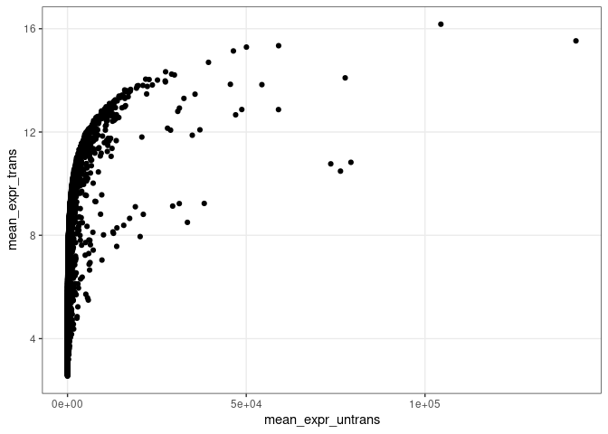<!-- -->

We can already run a clustering analysis on this data, but we have to
accept that this may simply lump together highly vs lowly expressed
genes. With the transformed, scaled expression data, we calculate the
euclidean distance between each gene. This distance matrix is then fed
to the hierarchical clustering algorithm. The clustering method is
‘complete linkage’ which aims to put genes into similar clusters.

After running the clustering algorithm, we would like to visualize the
clusters. Let’s take the first 10 clusters.

Here are the number of genes in each cluster. Some of the clusters have
rather few genes:

    ## 
    ##    1    2    3    4    5    6    7    8    9   10 
    ## 4212 3028 3776  896   64  125   54    5   10   26

We add the clusters to the transformed expression data for plotting.

The time-course of the gene expression is then plotted. We can see how
the first four clusters just separate genes with different expression
levels. Other clusters, though, distinguish genes that are up or down
regulated at the beginning or end of the life cycle.

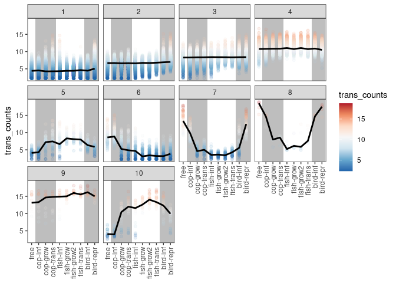<!-- -->

Clustering genes that just have high or low expression is not
particularly interesting. Rather, we are more interested in patterns of
co-expression across the life cycle, i.e. genes that show similar
patterns of increasing and decreasing expression. Therefore, we scale
the transformed expression values to a z-score for each gene.

With the transformed, scaled expression data, we again calculate the
euclidean distance between each gene and give this distance matrix to
the clustering algorithm.

After running the clustering algorithm, we would like to visualize the
clusters. Let’s again take the first 10 clusters.

Here are the number of genes in each cluster:

    ## 
    ##    1    2    3    4    5    6    7    8    9   10 
    ## 1500 1064 2252 1672 1570 1259 1521  596  566  196

After adding the clusters to the transformed expression data, the
time-course of expression is plotted.

Some trends are notable, such as clusters with increased expression in
birds or the free stages.

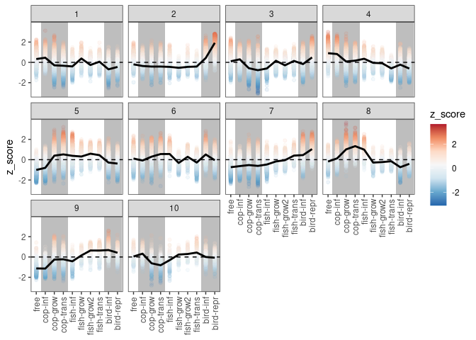<!-- -->

## How many clusters

Ten clusters was arbitrary. One way to estimate how many clusters there
are in the data is to perform a faster clustering algorithm (kmeans)
with different numbers of pre-defined clusters. Then, we can see how the
variance within clusters decreases as a function of the number of
clusters. Here is the pattern:

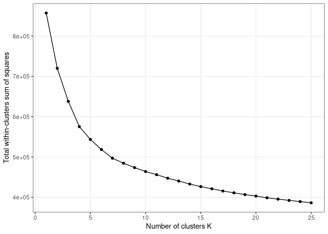<!-- -->

In this “elbow plot”, we are looking for a break in the line (an elbow)
where additional clusters do not reduce within cluster variance much.
Unfortunately, the trend looks fairly linear on a log-scale, in that
each additional cluster decreases variance proportionally. We can plot
this. Perhaps there is a break at 4 and 7 clusters.

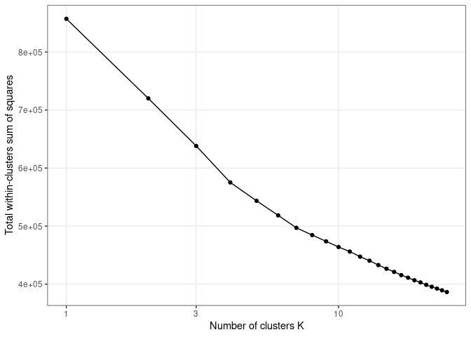<!-- -->

Thus, let’s go back to our hierarchical clustering, but now take the top
7 clusters.

Here are the number of genes in each cluster:

    ## 
    ##    1    2    3    4    5    6    7 
    ## 1500 2323 2252 1672 2332 1521  596

Some patterns are still evident, but it is not clear that reducing the
number of clusters “improved” the patterns.

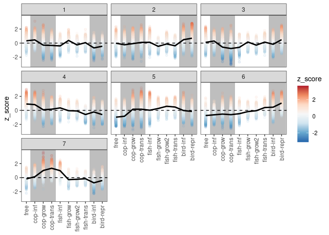<!-- -->

Taking much finer clusters also does not produce far clearer trends.
Rather, some of the clusters are probably repeating.

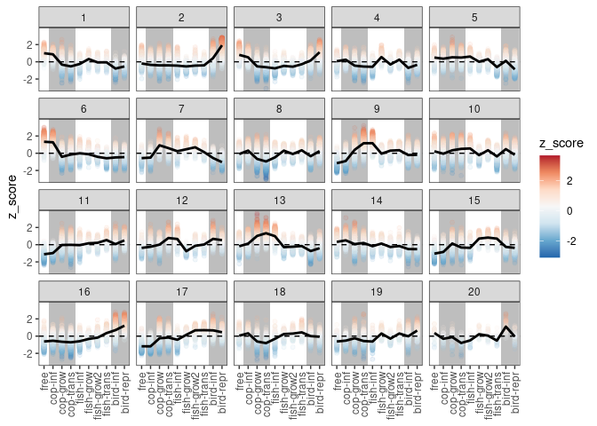<!-- -->

## Different clustering algorithms

Let’s try a different clustering algorithm. Cluster membership can vary
quite a lot between clustering algorithms (see
[here](https://cran.r-project.org/web/packages/dendextend/vignettes/Cluster_Analysis.html)).
Instead of ‘complete linkage’, we’ll try ‘average’, which makes a UPGMA
tree from the distance matrix. And again we’ll take the top 7 clusters.

Here are the number of genes in each cluster - they are quite different
from the ‘complete linkage’ algorithm:

    ## 
    ##    1    2    3    4    5    6    7 
    ## 2895 2396 1840 2976 2050   23   16

Changing the algorithm did not obviously result in better patterns.

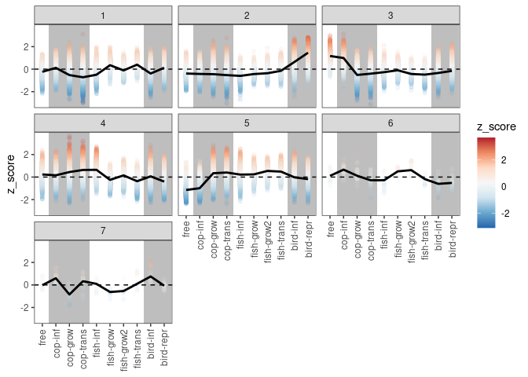<!-- -->

We can also try the Ward method (`method = Ward.D2`), which minimizes
the variance. We take 7 clusters as above.

Here are the number of genes per cluster. Again, they diverge from the
‘complete linkage’ algorithm:

    ## 
    ##    1    2    3    4    5    6    7 
    ## 1705 3426 1708 1026 1924 1497  910

The ward algorithm seems to yield clearer patterns, with sharper changes
in expression at certain stage transitions.

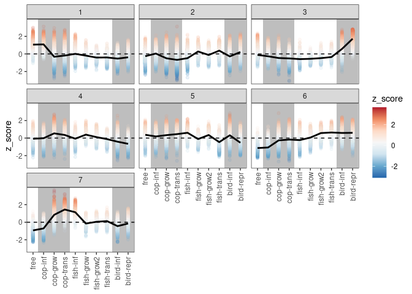<!-- -->

Finally, we can also try the ‘single linkage’ method in `hclust`.

But this approach does not seem to work at all, as all genes are placed
into one cluster.

    ## 
    ##     1     2     3     4     5     6     7 
    ## 12190     1     1     1     1     1     1

# Differentially expressed genes

One possible way to improve clustering would be to use only
differentially expressed genes. Let’s import the genes that differed in
expression, as judged by `DESeq2` models.

## DEGs among hosts

We start by just isolating genes that were differentially expressed
among hosts. Here are the number of genes where counts were high enough
that `DESeq2` performed a LRT:

    ## [1] 12196

Out of these, this number had low expression levels under our criteria
above (because they were removed before fitting the models).

    ## [1] 0

So, with a conservative p-value threshold, many of these genes will be
removed. Here are the number of DEGs at different levels of
significance. A 10-fold change in the p-value usually removes roughly
1000 genes from the list.

| p0.01 | p0.001 | p0.0001 | p0.00001 | p0.000001 |
|------:|-------:|--------:|---------:|----------:|
|  8600 |   7396 |    6382 |     5530 |      4804 |

Let’s only take the genes that had p-values less than 0.0001.

Here is an log-transformed elbow plot, based on kmeans clustering, with
those genes. There are at least 3 or 4 clusters.

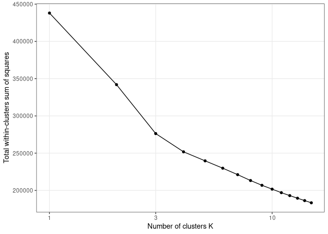<!-- -->

Now, we filter the count matrix to just the DEGs and we re-calculate the
distance matrix, which is then fed into the clustering algorithm
(`method = 'ward.D2'`).

Given the elbow plot, let’s take the top 5 clusters.

Here are the number of genes in each cluster. There are none with very
few genes.

    ## 
    ##    1    2    3    4    5 
    ## 1344 2078  686 1452  822

With the DEGs, the patterns are similar to the full dataset, though
perhaps more pronounced. The genes that were not assigned to a cluster
(NA) are genes that are not strongly differentially expressed.

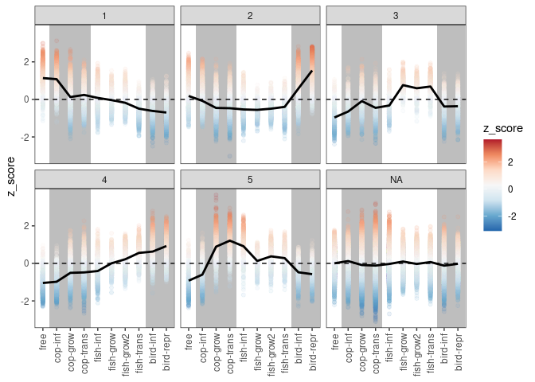<!-- -->

Some of the trends might be easier to assess if we plot the expression
profiles for individual genes. Let’s sample 100 random genes from each
cluster and plot them.

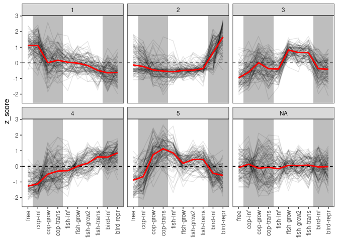<!-- -->

This uncovers a little more nuance within the clusters, such that we can
see why some were clusters were split (e.g. more variance at some stages
than others). This plot also shows that expression trends are not
entirely explained by host, because within hosts expression often
changed from one life stage to the next. This suggests that gene
expression patterns will be better captured by the full model. But
before looking at the full model, let’s consider the DEGs among
functions.

## DEGs among functions

One model tested which genes were differentially expressed at particular
functions, like invasion, growth, transmission, etc. Here are the number
of genes where counts were high enough that `DESeq2` performed a LRT:

    ## [1] 12196

Here are the number of DEGs at different levels of significance. There
are fewer DEGs among functions than among hosts.

| p0.01 | p0.001 | p0.0001 | p0.00001 | p0.000001 |
|------:|-------:|--------:|---------:|----------:|
|  7465 |   5687 |    4407 |     3529 |      2924 |

Let’s only take the genes that had p-values less than 0.0001.

Here is the log-transformed elbow plot, based on kmeans clustering, with
those genes. There is maybe only 1 or 2 clusters.

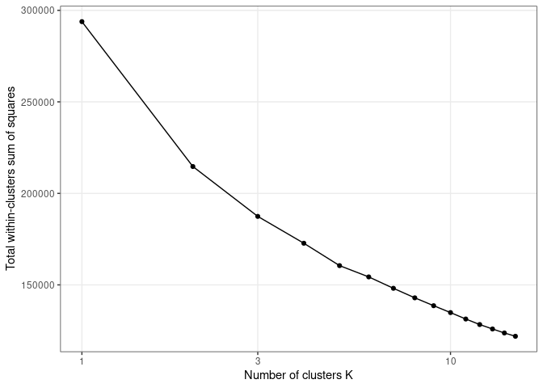<!-- -->

Now, we filter the count matrix to just the DEGs and we re-calculate the
distance matrix, which is then fed into the clustering algorithm
(`method = 'ward.D2'`).

For comparison to the host model, we take the top 5 clusters.

Here are the number of genes in each cluster. Some clusters are
relatively small.

    ## 
    ##    1    2    3    4    5 
    ## 1236 1014  588 1035  534

The expression profiles shows that the first two clusters (which were
the largest) are for genes up or down regulated in the reproductive
stage.

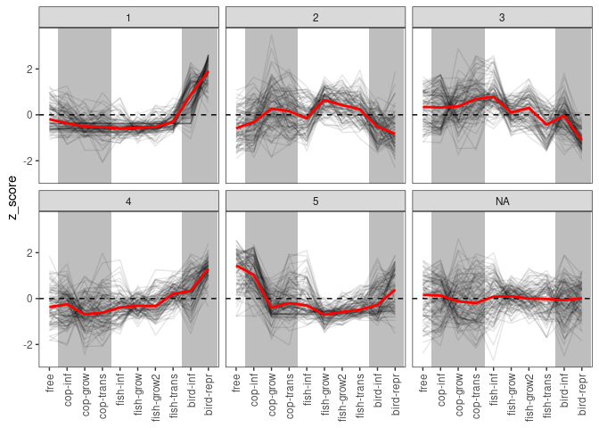<!-- -->

The expression profiles clearly suggest that expression does not depend
entirely on the hosts or the function. Rather, they can depend on both.

## DEGs among all life stages

Thus, the model with all developmental stages is probably the best.
Let’s assess this by looking at the number of genes considered
differentially expressed by different models.

### DEGs, host vs developmental stage

This table shows the number of genes identified as differentially
expressed (p \< 0.001) among ‘hosts’ and among ‘developmental stages’. A
large number of genes (\~7000) were considered DE by both models. But
the full model considered another \~4000 genes as DE that the host model
did not. By contrast, only a small number of genes (75) were considered
DE by the host model but not the full model. It is also reassuring that
the \~1000 genes with high enough counts to justify a LRT in the full
model, but not in the host model, were all not significant.

    ##              int_host
    ## int_condition    no   yes   Sum
    ##           no   1250    41  1291
    ##           yes  3550  7355 10905
    ##           Sum  4800  7396 12196

Of the \~7000 genes that were DE in both models, the p-value was almost
always lower in the full model, suggesting that most of these genes do
not vary in a purely host-driven way.

    ## 
    ## FALSE  TRUE 
    ##   314  7082

The p-values are from model comparisons with an intercept-only model
(i.e. host vs int-only, full vs int-only). Thus, the p-value are just a
test of total variance explained by the model. A better comparison is
how much more variance is explained in the full vs the host-only model.
Let’s consider that comparison.

The table rows tally the genes considered DE by the full model
(int_condition) whereas the columns are the genes where the full model
is an improvement over the host-only model (host_condition). Out of all
DE genes (\~11000), most (9000) are not purely host-driven, i.e. the
full model is an improvement over the host-only model.

    ##              host_condition
    ## int_condition    no   yes   Sum
    ##           no   1230    61  1291
    ##           yes  2185  8720 10905
    ##           Sum  3415  8781 12196

Still, there are about 2000 DE genes for which the full model was not an
improvement. Let’s look at the profiles for these genes.

The log-transformed elbow plot suggests there are only a couple
clusters.

<!-- -->

Unsurprisingly, these are the genes that are mainly up or down regulated
at the end of the life cycle in the in vitro bird.

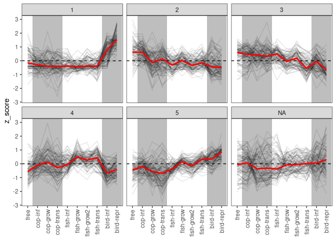<!-- -->

### DEGs, function vs devo stage

Now, we compare the genes identified as differentially expressed (p \<
0.001) among ‘functional stages’ and among ‘developmental stages’. Like
the host model comps above, large number of genes (\~6000) were
considered DE by both models. The full model considered another \~5500
genes as DE that the stage model did not, which was more than in the
host model. By contrast, few genes (81) were considered DE by the stage
model but not the full model. Again, the genes with high enough counts
to justify a LRT in the full model (\~750), but not in the simpler stage
model, were all not significant.

    ##              int_stage
    ## int_condition    no   yes   Sum
    ##           no   1248    43  1291
    ##           yes  5261  5644 10905
    ##           Sum  6509  5687 12196

For almost all of the genes that were DE in both models, the p-value was
lower in the full model, suggesting that most of these genes do not vary
in a purely function-driven way.

    ## 
    ## FALSE  TRUE 
    ##   324  5363

We also directly compared the stage-only and full models and found
patterns similar to the host-only vs full comparison. The table below
tallies the genes considered DE by the full model (int_condition) vs
those genes where the full model is an improvement over the
function-only model (stage_condition). Most DE genes (\~9000 out of
11000) are not purely function-driven, i.e. the full model was an
improvement.

    ##              stage_condition
    ## int_condition    no   yes   Sum
    ##           no   1231    60  1291
    ##           yes  2105  8800 10905
    ##           Sum  3336  8860 12196

But as above, there are about 2000 DE genes for which the full model was
not an improvement. These are probably genes upregulated in
“reproducing” stages.

The expression profiles are consistent with that.

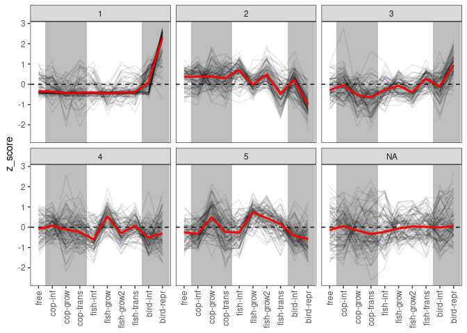<!-- -->

### All DEGs expression profiles

Here are the number of genes where counts were high enough that `DESeq2`
performed a LRT:

    ## [1] 12196

Out of these, this number had low expression levels under our criteria
above.

    ## [1] 0

Moreover, they are the genes that are not differentially expressed:

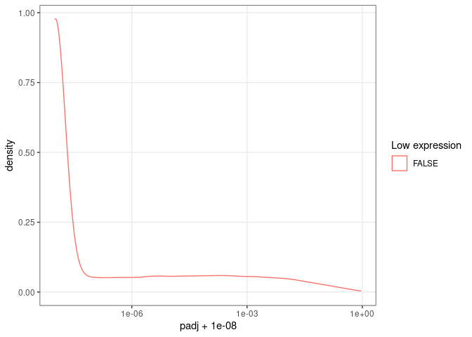<!-- -->

So, when we take a conservative p-value threshold, many of these genes
will be removed. Here are the number of DEGs at different levels of
significance. This is higher than the host-only or stage-only model. A
10-fold change in the p-value usually removes roughly 1000 genes from
the list.

| p0.01 | p0.001 | p0.0001 | p0.00001 | p0.000001 |
|------:|-------:|--------:|---------:|----------:|
| 11556 |  10905 |   10208 |     9499 |      8831 |

Let’s only take the genes that had p-values less than 0.0001.

Here is an log-transformed elbow plot, based on kmeans clustering, with
those genes. There are at least 4 clusters.

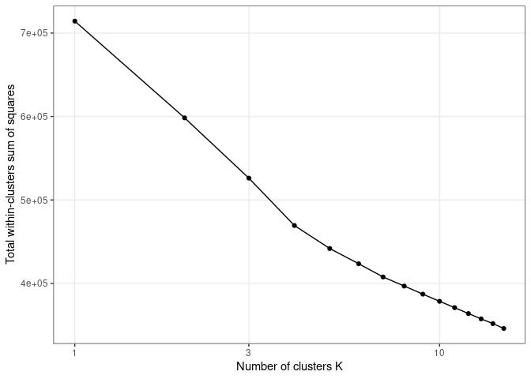<!-- -->

Now, we filter the count matrix to just the DEGs and we re-calculate the
distance matrix, which is then fed into the clustering algorithm
(`method = 'complete'`).

Given the elbow plot, let’s take the top 8 clusters.

Here are the number of genes in each cluster. There are none with very
few genes.

    ## 
    ##    1    2    3    4    5    6    7    8 
    ##  799  841 2259 1538 1535  938 1633  665

With the DEGs, the patterns are clearer, but some of the clusters still
look somewhat redundant. The genes that were not assigned to a cluster
(NA) are genes that are not strongly differentially expressed.

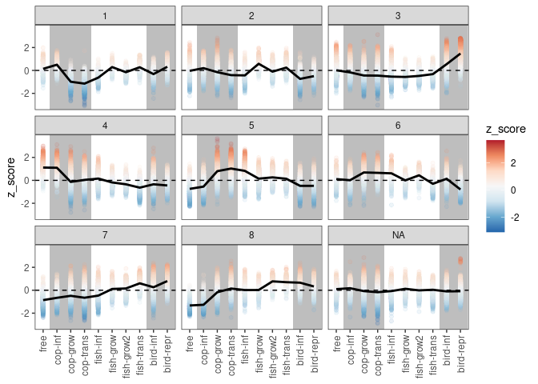<!-- -->

Some of the trends might be easier to assess if we plot the expression
profiles for individual genes. Let’s sample 100 random genes from each
cluster and plot them. This uncovers a little more nuance within the
clusters, such that we can see why some clusters were split (e.g. more
variance at some stages than others).

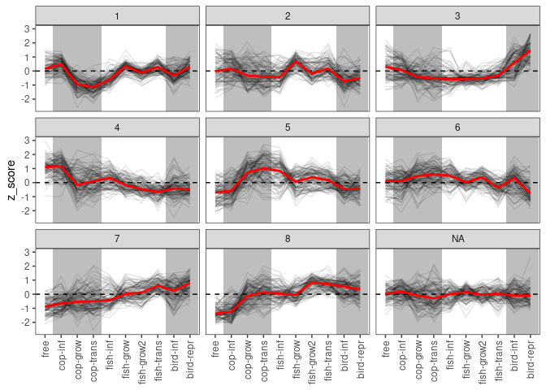<!-- -->

New patterns do not obviously emerge when the number of clusters is
expanded.

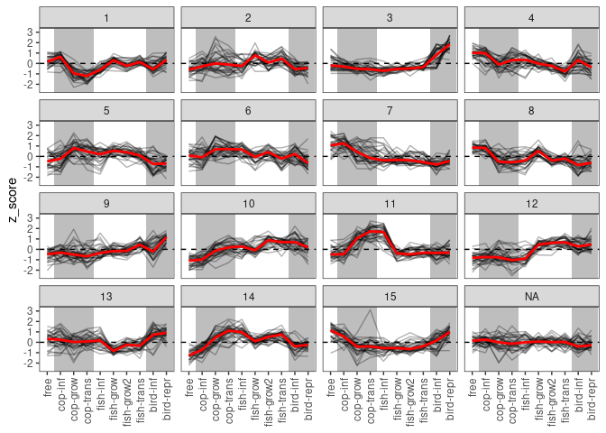<!-- -->

## Heatmap

Some of the clusters in the previous plot are rather similar. A common
way to visualize clusters, such that similar ones are next to each
other, are heatmaps. I used this
[approach](https://genviz.org/module-04-expression/0004/02/01/DifferentialExpression/)
to build a heatmap.

I picked the 7000 genes that were most strongly differentially expressed
across life stages. Then, I reran the clustering algorithm and produced
a dendrogram.

The normalized expression data for these genes need to be rearranged
into long format for plotting.

The final plot is a conglomeration of several sub-elements, including
the dendrogram, a heatmap, and tiles that distinguish the groups.

After making the sub-elements, they need to be aligned and glued
together. For this they are converted to ‘grobs’.

Here is the final product, showing the major clusters.

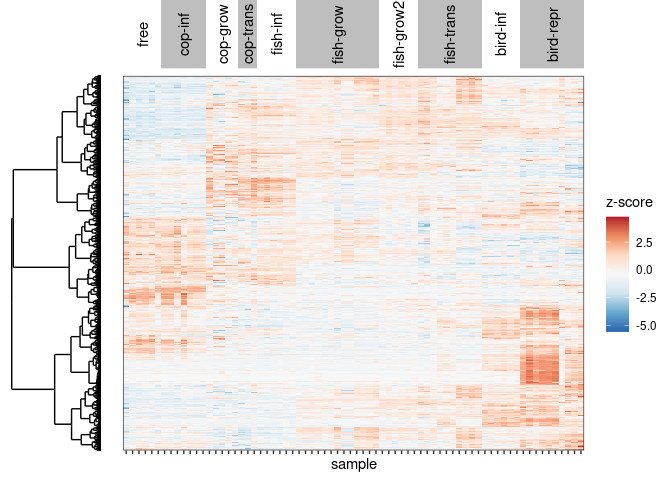<!-- -->

# *Clust* algorithm

Alternatively, different clustering algorithms could be used. For
example, instead of assigning all genes to clusters, this
[algorithm](https://genomebiology.biomedcentral.com/articles/10.1186/s13059-018-1536-8)
tries to extract clusters of genes with similar expression. I ran the
algorithm (see commands [here](run_clust.txt)) on the full set of genes
and the differentially expressed genes.

These *clust* tests were not included in the Repo, so the code is
commented out.

## All genes

*clust* only extracted two clusters from the full dataset.

When we plot them, we see that one cluster groups genes that are down
regulated in the early life stages, whereas the other cluster is quite
variable.

## Differentially expressed genes

*clust* only extracted one cluster from the set of DEGs.

The plot of this single cluster is not very convincing.

# Summary

In conclusion, some of the largest changes in gene expression occur at
the beginning and end of the life cycle. Most changes in gene expression
cannot be neatly attributed to changing the host or changing the
function. Rather, gene expression can vary within hosts and among
functionally similar stages in different hosts.

    ## R version 4.2.1 (2022-06-23)
    ## Platform: x86_64-pc-linux-gnu (64-bit)
    ## Running under: Debian GNU/Linux 11 (bullseye)
    ## 
    ## Matrix products: default
    ## BLAS:   /usr/lib/x86_64-linux-gnu/openblas-pthread/libblas.so.3
    ## LAPACK: /usr/lib/x86_64-linux-gnu/openblas-pthread/libopenblasp-r0.3.13.so
    ## 
    ## locale:
    ##  [1] LC_CTYPE=en_US.UTF-8       LC_NUMERIC=C              
    ##  [3] LC_TIME=en_US.UTF-8        LC_COLLATE=en_US.UTF-8    
    ##  [5] LC_MONETARY=en_US.UTF-8    LC_MESSAGES=en_US.UTF-8   
    ##  [7] LC_PAPER=en_US.UTF-8       LC_NAME=C                 
    ##  [9] LC_ADDRESS=C               LC_TELEPHONE=C            
    ## [11] LC_MEASUREMENT=en_US.UTF-8 LC_IDENTIFICATION=C       
    ## 
    ## attached base packages:
    ## [1] grid      stats     graphics  grDevices utils     datasets  methods  
    ## [8] base     
    ## 
    ## other attached packages:
    ##  [1] gridExtra_2.3   gtable_0.3.0    ggdendro_0.1.23 forcats_0.5.1  
    ##  [5] stringr_1.4.0   dplyr_1.0.9     purrr_0.3.4     readr_2.1.2    
    ##  [9] tidyr_1.2.0     tibble_3.1.7    ggplot2_3.3.6   tidyverse_1.3.1
    ## 
    ## loaded via a namespace (and not attached):
    ##  [1] bitops_1.0-7                matrixStats_0.62.0         
    ##  [3] fs_1.5.2                    lubridate_1.8.0            
    ##  [5] bit64_4.0.5                 RColorBrewer_1.1-3         
    ##  [7] httr_1.4.3                  GenomeInfoDb_1.30.0        
    ##  [9] tools_4.2.1                 backports_1.4.1            
    ## [11] utf8_1.2.2                  R6_2.5.1                   
    ## [13] DBI_1.1.2                   BiocGenerics_0.40.0        
    ## [15] colorspace_2.0-3            withr_2.5.0                
    ## [17] tidyselect_1.1.2            DESeq2_1.34.0              
    ## [19] bit_4.0.4                   compiler_4.2.1             
    ## [21] cli_3.3.0                   rvest_1.0.2                
    ## [23] Biobase_2.54.0              xml2_1.3.3                 
    ## [25] DelayedArray_0.20.0         labeling_0.4.2             
    ## [27] scales_1.2.0                genefilter_1.76.0          
    ## [29] digest_0.6.29               rmarkdown_2.14             
    ## [31] XVector_0.34.0              pkgconfig_2.0.3            
    ## [33] htmltools_0.5.2             MatrixGenerics_1.6.0       
    ## [35] highr_0.9                   dbplyr_2.1.1               
    ## [37] fastmap_1.1.0               rlang_1.0.2                
    ## [39] readxl_1.4.0                rstudioapi_0.13            
    ## [41] RSQLite_2.2.14              farver_2.1.0               
    ## [43] generics_0.1.2              jsonlite_1.8.0             
    ## [45] BiocParallel_1.28.3         RCurl_1.98-1.6             
    ## [47] magrittr_2.0.3              GenomeInfoDbData_1.2.7     
    ## [49] Matrix_1.4-1                Rcpp_1.0.8.3               
    ## [51] munsell_0.5.0               S4Vectors_0.32.3           
    ## [53] fansi_1.0.3                 lifecycle_1.0.1            
    ## [55] stringi_1.7.6               yaml_2.3.5                 
    ## [57] MASS_7.3-57                 SummarizedExperiment_1.24.0
    ## [59] zlibbioc_1.40.0             blob_1.2.3                 
    ## [61] parallel_4.2.1              crayon_1.5.1               
    ## [63] lattice_0.20-45             splines_4.2.1              
    ## [65] Biostrings_2.62.0           haven_2.5.0                
    ## [67] annotate_1.72.0             KEGGREST_1.34.0            
    ## [69] hms_1.1.1                   locfit_1.5-9.5             
    ## [71] knitr_1.39                  pillar_1.7.0               
    ## [73] GenomicRanges_1.46.1        geneplotter_1.72.0         
    ## [75] stats4_4.2.1                reprex_2.0.1               
    ## [77] XML_3.99-0.9                glue_1.6.2                 
    ## [79] evaluate_0.15               modelr_0.1.8               
    ## [81] png_0.1-7                   vctrs_0.4.1                
    ## [83] tzdb_0.3.0                  cellranger_1.1.0           
    ## [85] assertthat_0.2.1            cachem_1.0.6               
    ## [87] xfun_0.30                   xtable_1.8-4               
    ## [89] broom_0.8.0                 survival_3.3-1             
    ## [91] memoise_2.0.1               AnnotationDbi_1.56.2       
    ## [93] IRanges_2.28.0              ellipsis_0.3.2
